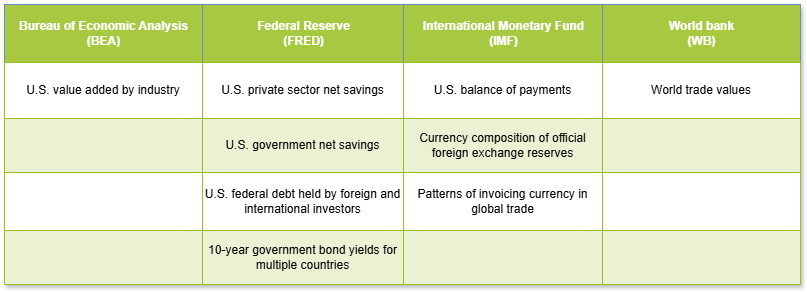
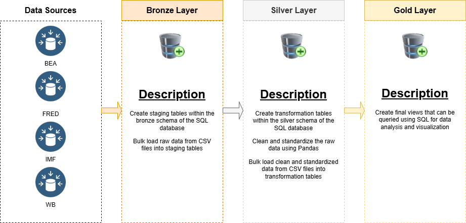

# Project Overview
Public policy discussions regarding the effects of protectionist measures are receiving the spotlight once again as the Trump administration wages a second round of trade wars in 2025. Despite political claims to the contrary, this project presents a short memo arguing that the U.S. is unlikely to succeed in reversing its trade and fiscal deficits and reindustrializing its economy. Instead, Trump's trade policies may end up undermining the global dollar system by pushing the international community away from the U.S. sphere of influence.

To substantiate the memo narrative, the project involved:

1. Identifying supporting data sources
2. Inspecting and extracting raw data
3. Building a SQL data warehouse utilizing a medallion architecture to store and transform the raw data
4. Querying the transformed data using SQL
5. Converting SQL tables into dataframes using Pandas
6. Generating data visualizations using Matplotlib and Seaborn
7. Creating the memo using Quarto

# Data Sources
The table below organizes the raw data reports by data source:

To access the raw data reports from the data source, find and click the relevant link from the list below:

* **BEA**
  * [U.S. value added by industry](https://apps.bea.gov/iTable/?reqid=1603&step=2&Categories=GDPxInd&isURI=1&_gl=1*1p8txdt*_ga*MTIzMjIwNTY4Ni4xNzYyMzU1OTUz*_ga_J4698JNNFT*czE3NjMxMzg3MTEkbzkkZzEkdDE3NjMxMzg3NDckajI0JGwwJGgw#eyJhcHBpZCI6MTYwMywic3RlcHMiOlsxLDIsNF0sImRhdGEiOltbImNhdGVnb3JpZXMiLCJHRFB4SW5kIl0sWyJUYWJsZV9MaXN0IiwiVFZBMTA1Il1dfQ==)

* **FRED**
  * [U.S. private sector net savings](https://fred.stlouisfed.org/series/W201RC1A027NBEA)
  * [U.S. government net savings](https://fred.stlouisfed.org/series/A922RC1A027NBEA)
  * [U.S. federal debt held by foreign and international investors](https://fred.stlouisfed.org/series/FDHBFIN)
  * [U.S. total federal debt](https://fred.stlouisfed.org/series/GFDEBTN)
  * [10-year government bond yields for multiple countries](https://fred.stlouisfed.org/searchresults/?st=Interest%20Rates%3A%20Long-Term%20Government%20Bond%20Yields%3A%2010-Year)
 
* **IMF**
  * [U.S. balance of payments](https://data.imf.org/en/datasets/IMF.RES:WEO)
  * [Currency composition of official foreign exchange reserves](https://data.imf.org/en/datasets/IMF.STA:COFER)
  * [Patterns of invoicing currency in global trade](https://data.mendeley.com/datasets/6z6w78968m/1)
 
* **WB**
  * [World trade values](https://databank.worldbank.org/source/world-development-indicators?Series=SE.XPD.CTOT.ZS)    

# Raw data

The table below maps the raw data reports to their file names:

The CSV files are stored in the repo folder named **raw_dataset**:

[Link to raw_datasets repo folder](https://github.com/0-5stepdown/Global_Dollar_System/tree/main/raw_datasets)

# Data Warehouse

The diagram below provides a high-level overview of how the raw data was stored and transformed within the medallion architecture of the SQL data warehouse:

* **Database**: A database named **DataWarehouse** was created with **bronze**, **silver**, and **gold** schemas in conformance with the medallion architecture.

* **Bronze**: 18 staging tables were created to store the raw data reports in their original forms. All columns retained their names and data types.
 
* **Silver**: The raw data reports were then cleaned, standardized, and stored in 8 transformation tables. Examples of data wrangling include:
  * Applying consistent column name formats and data types
  * Handling missing data
  * Removing duplicate entries
  * Removing unnecessary columns
  * Scaling numeric values
  * Joining related raw data reports (e.g., trade invoice currency percentage and trade values)
  * Removing special characters
  * Simplifying long text values in columns
  * Creating new features

 * **Gold**: Lastly, SQL views were created to manipulate the transformation tables for analysis and visualization. Examples of manipulations include:
   * Creating a union of related tables (e.g., U.S. public and private net savings)
   * Filtering for specific date ranges    

The codes used to create the Data Warehouse are stored in the repo folder named **scripts**: 

[Link to scripts repo folder](https://github.com/0-5stepdown/Global_Dollar_System/tree/main/scripts)

# Data Analysis and Visualizations

To substantiate the memo narrative, the following data analysis and visualization were conducted:

* U.S. dollar's share of global trade
* Comparison of U.S. current account and financial accounts to convey dollar inflows and outflows
* U.S. dollar's share of disclosed international reserves
* Breakdown of U.S. debt between domestic and foreign sources
* Comparison of U.S. private and public net savings
* Comparison of 10-year government bond yields between select countries
* U.S. total GDP and breakdown between manufacturing and financial sectors

The codes used to generate the data analysis and visualizations are stored in the repo folder named **code**:

[Link to code repo folder](https://github.com/0-5stepdown/Global_Dollar_System/tree/main/code)

# Memo

The memo is hosted as a HTML Quarto document at the GitHub page linked below:

[Global Dollar Sytem Memo](https://0-5stepdown.github.io/Global_Dollar_System/)

# Credit

The medallion architecture for the SQL data warehouse was inspired by instruction from **Baraa Khatib Salkini** at **Data with Baraa**.

[Data With Baraa - SQL Data Warehouse Project](https://github.com/DataWithBaraa/sql-data-warehouse-project)
